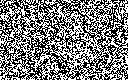
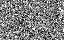
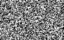
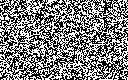
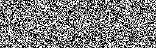
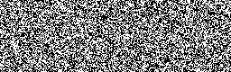
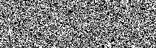
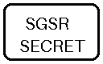

# Image Tutorial

This tutorial starts from saved optimized constructions.  Encoding therefore
does not repeat the optimization step.

## Demo secret

Generate the deterministic sample image:

```bash
python examples/make_demo_secret.py
```


## General access structure

The example has minimal qualified coalitions `{1,2}` and `{1,3,4}`.  First
solve and save the construction:

```bash
sarr-xvcs general examples/general_access.json \
  --output docs/assets/general/construction.json
```

Encode the secret with a deterministic demonstration seed:

```bash
sarr-xvcs encode-image \
  docs/assets/general/construction.json \
  examples/secret.png \
  docs/assets/general \
  --seed 7
```

Each participant receives one image:

| Participant 1 | Participant 2 | Participant 3 | Participant 4 |
|---|---|---|---|
|  |  |  |  |

Participants 1 and 2 are qualified.  Recover their secret:

```bash
sarr-xvcs recover-image docs/assets/general 1,2 \
  --output-name recovered_1_2.png
```


Trying an unqualified coalition such as `1,3` raises an error and does not
create a recovered image.

## Complete `(2,3)` threshold structure

Create the exact threshold construction:

```bash
sarr-xvcs threshold 2 3 \
  --output docs/assets/threshold/construction.json
```

Encode the same secret:

```bash
sarr-xvcs encode-image \
  docs/assets/threshold/construction.json \
  examples/secret.png \
  docs/assets/threshold \
  --seed 11
```

| Participant 1 | Participant 2 | Participant 3 |
|---|---|---|
|  |  |  |

Any two participants recover the image.  For example:

```bash
sarr-xvcs recover-image docs/assets/threshold 2,3 \
  --output-name recovered_2_3.png
```



One participant alone is rejected because no region contains both required
share types.

## What the expanded share width means

One selected construction region contributes one complete binary region image.
The PNG concatenates these complete images horizontally in region order as
`[R1 | R2 | ... | Rm]`. Thus a source image of width `W` and a construction
with pixel expansion `m` produces shares of width `W*m`. `metadata.json`
records this block layout, `W`, `m`, the participant order, and the region used
for each valid recovery.
